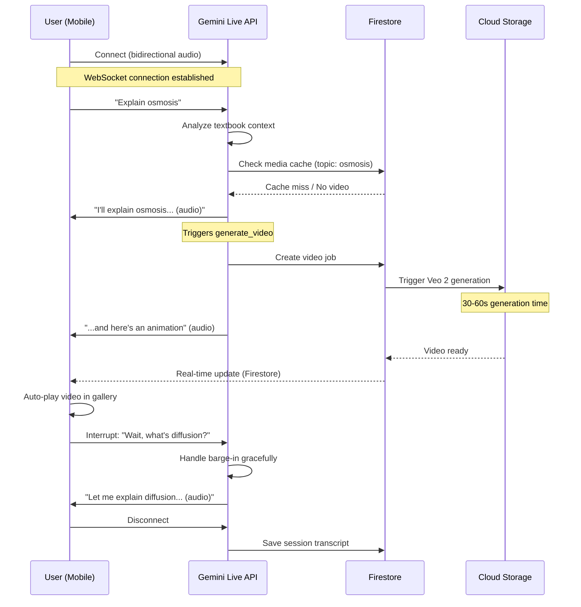
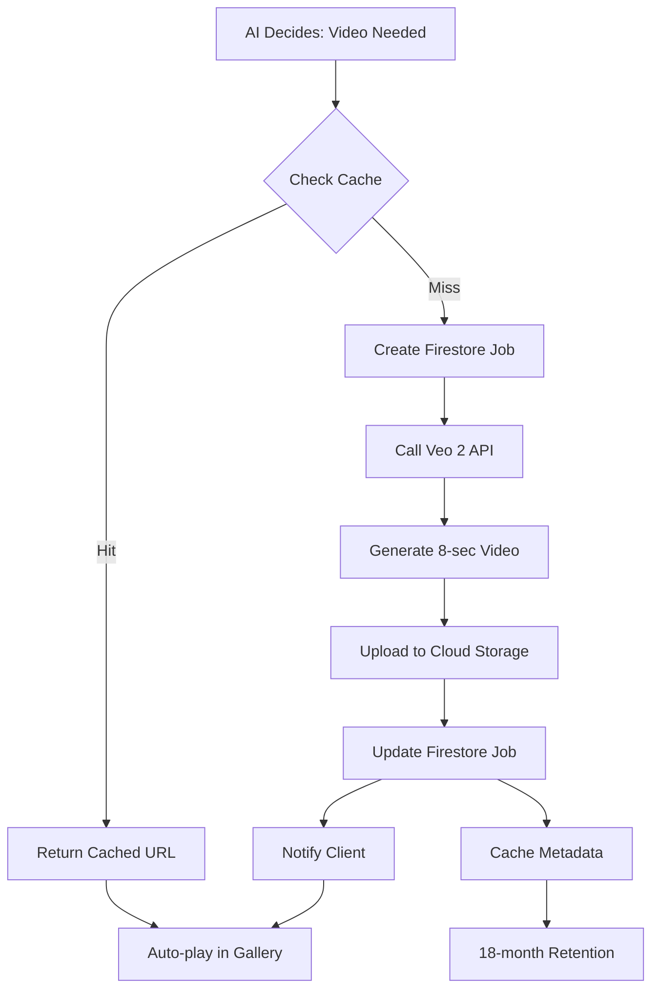

# Mama AI - Architecture & Submission Documentation

## Gemini Live Agent Challenge Submission
**Category**: Live Agent (Real-time multimodal AI tutor)
**Project**: Mama AI - Voice-first STEM tutoring with textbook grounding

---

## 1. System Overview

Mama AI is a voice-first mobile tutoring application that provides immersive, multimodal educational experiences. Unlike generic AI tutors, Mama AI grounds all explanations in uploaded textbook PDFs, ensuring accuracy and curriculum alignment.

### Core Value Proposition
- **Textbook-Grounded**: Uses uploaded PDFs as immutable truth source
- **Voice-First**: Real-time bidirectional audio via Gemini Live API
- **Multimodal**: Audio + Vision + Generated Images + Generated Videos
- **Persistent**: Media library follows students across sessions

---

## 2. Architecture Diagram

```
┌─────────────────────────────────────────────────────────────────────────────┐
│                              CLIENT (Mobile Web)                            │
│  ┌──────────────┐  ┌──────────────┐  ┌──────────────┐  ┌─────────────────┐  │
│  │   Voice UI   │  │  Whiteboard  │  │ Media Gallery│  │ Camera Upload   │  │
│  │  (TutorChat) │  │   (KaTeX)    │  │(Images/Vids) │  │  (Homework)     │  │
│  └──────┬───────┘  └──────┬───────┘  └──────┬───────┘  └────────┬────────┘  │
└─────────┼─────────────────┼─────────────────┼───────────────────┼───────────┘
          │                 │                 │                   │
          └─────────────────┴─────────────────┴───────────────────┘
                              │
                    ┌─────────▼─────────┐
                    │   GenAI SDK       │
                    │ (@google/genai)   │
                    └─────────┬─────────┘
                              │
          ┌───────────────────┼───────────────────┐
          │                   │                   │
          ▼                   ▼                   ▼
┌─────────────────┐  ┌──────────────────┐  ┌─────────────────┐
│  Gemini Live API│  │ Gemini 3.1 Flash │  │   Veo 2 Video   │
│ (Bidirectional) │  │  Image Generate  │  │   Generation    │
│                 │  │                  │  │                 │
│ • Audio Input   │  │ • 9:16 Portrait  │  │ • 9:16 Portrait │
│ • Audio Output  │  │ • Educational    │  │ • 8-sec Silent  │
│ • Tool Calling  │  │ • Diagram-based  │  │ • Auto-cached   │
└────────┬────────┘  └────────┬─────────┘  └────────┬────────┘
         │                    │                     │
         │                    │                     │
         └────────────────────┴─────────────────────┘
                              │
              ┌───────────────┴───────────────┐
              │       GOOGLE CLOUD PLATFORM    │
              └───────────────┬───────────────┘
                              │
        ┌─────────────────────┼─────────────────────┐
        │                     │                     │
        ▼                     ▼                     ▼
┌───────────────┐    ┌───────────────┐    ┌───────────────┐
│  Cloud Firestore│   │ Cloud Storage │    │  Cloud Run    │
│               │    │               │    │               │
│ • Sessions    │    │ • PDFs        │    │ • Hosting     │
│ • Media Cache │    │ • Images      │    │ • API         │
│ • User Data   │    │ • Videos      │    │ • Streaming   │
│ • Video Jobs  │    │ • Diagrams    │    │               │
└───────────────┘    └───────────────┘    └───────────────┘
```

---

## 3. Multimodal Data Flow

### 3.1 Voice Mode Session (Primary Flow)



### 3.2 Video Generation Pipeline



---

## 4. Google Cloud Services Integration

### 4.1 Cloud Firestore Schema

```
/users/{userId}
  ├── profile: { name, grade, curriculum }
  ├── preferences: { voice, autoVideo }
  └── sessions/
      └── {sessionId}
          ├── date: timestamp
          ├── mode: 'lab' | 'exam'
          ├── summary: string
          ├── messages: [...]
          └── generationJob?: {...}

/users/{userId}/mediaCache/{cacheKey}
  ├── cacheKey: string (hash of topic)
  ├── topicName: string
  ├── chapterId: string
  ├── mediaType: 'image' | 'video'
  ├── mediaUrl: string (Storage URL)
  ├── createdAt: timestamp
  └── expiresAt: timestamp (+18 months)

/videoJobs/{jobId}
  ├── userId: string
  ├── sessionId: string
  ├── concept: string
  ├── status: 'pending' | 'processing' | 'completed' | 'failed'
  ├── storageUrl?: string
  ├── error?: string
  ├── createdAt: timestamp
  └── completedAt?: timestamp
```

### 4.2 Cloud Storage Structure

```
mama-ai-bucket/
├── textbooks/
│   └── {userId}/
│       └── {textbookId}.pdf
├── generated/
│   └── {userId}/
│       ├── images/
│       │   └── {imageId}.png
│       └── videos/
│           └── {videoId}.mp4
└── diagrams/
    └── {textbookId}/
        └── page_{n}.png
```

### 4.3 Cloud Run Configuration

```yaml
# service.yaml
apiVersion: serving.knative.dev/v1
kind: Service
metadata:
  name: mama-ai
spec:
  template:
    spec:
      containers:
        - image: gcr.io/PROJECT_ID/mama-ai
          ports:
            - containerPort: 8080
          env:
            - name: GENAI_API_KEY
              valueFrom:
                secretKeyRef:
                  name: genai-api-key
            - name: FIREBASE_CONFIG
              valueFrom:
                secretKeyRef:
                  name: firebase-config
          resources:
            limits:
              memory: "2Gi"
              cpu: "2"
```

---

## 5. Gemini Model Usage

### 5.1 Model Selection

| Use Case | Model | Configuration |
|----------|-------|---------------|
| **Live Voice Sessions** | `gemini-2.5-flash-native-audio-preview-12-2025` | Native audio I/O, tool calling |
| **Image Generation** | `gemini-3.1-flash-image-preview` | 9:16 portrait, educational style |
| **Video Generation** | `veo-2.0-generate-001` | 9:16, 8 seconds, silent |
| **Text Chat** | `gemini-2.0-flash` | Standard chat completions |

### 5.2 Tool Calling Schema

```typescript
// Function declaration for Live API
const generateVideoFunction = {
  name: 'generate_video',
  description: 'Generate an 8-second educational animation for complex concepts',
  parameters: {
    type: 'object',
    properties: {
      concept: {
        type: 'string',
        description: 'Concept to visualize (e.g., "osmosis through semipermeable membrane")'
      },
      context: {
        type: 'string',
        description: 'Textbook context for accuracy'
      }
    },
    required: ['concept']
  }
};

const generateImageFunction = {
  name: 'generate_image',
  description: 'Generate educational diagram for visual explanation',
  parameters: {
    type: 'object',
    properties: {
      description: {
        type: 'string',
        description: 'Detailed description of diagram to generate'
      }
    },
    required: ['description']
  }
};
```

---

## 6. Cost Optimization Strategy

### 6.1 Video Generation Controls

| Constraint | Implementation | Rationale |
|------------|----------------|-----------|
| **Max 1 per topic** | Cache check before generation | Prevent redundant costs |
| **Skip introductions** | Skip if chapter name in concept | Save $0.10-0.20 per skip |
| **Auto vs Manual** | AI decides, user can request | Balance automation with control |
| **Veo 2 over Veo 3** | Use `veo-2.0-generate-001` | 50% cost savings |

### 6.2 Estimated Costs (Monthly)

| Component | Usage | Cost |
|-----------|-------|------|
| Gemini Live API | 100 hours | ~$100 |
| Veo 2 Video | 200 generations | ~$20-40 |
| Image Generation | 500 images | ~$5 |
| Firestore | 1M reads | ~$0.06 |
| Cloud Storage | 50GB | ~$1 |
| **Total** | | **~$130-150** |

---

## 7. Deployment Guide

### 7.1 Prerequisites

```bash
# Required tools
gcloud --version  # Google Cloud SDK
node --version    # Node.js 18+
npm --version     # npm 9+
```

### 7.2 Environment Variables

```bash
# .env.production
VITE_FIREBASE_API_KEY=
VITE_FIREBASE_AUTH_DOMAIN=
VITE_FIREBASE_PROJECT_ID=
VITE_FIREBASE_STORAGE_BUCKET=
VITE_FIREBASE_MESSAGING_SENDER_ID=
VITE_FIREBASE_APP_ID=
GENAI_API_KEY=  # Server-side only
```

### 7.3 Build & Deploy

```bash
# Build for production
npm run build

# Deploy to Cloud Run
gcloud run deploy mama-ai \
  --source . \
  --platform managed \
  --region us-central1 \
  --allow-unauthenticated \
  --set-secrets GENAI_API_KEY=genai-api-key:latest

# Verify deployment
gcloud run services describe mama-ai --region us-central1
```

### 7.4 Firestore Indexes

```bash
# Create composite indexes
gcloud firestore indexes composite create \
  --collection-group=mediaCache \
  --field-config fieldPath=userId,order=ascending \
  --field-config fieldPath=createdAt,order=descending

gcloud firestore indexes composite create \
  --collection-group=sessions \
  --field-config fieldPath=userId,order=ascending \
  --field-config fieldPath=date,order=descending
```

---

## 8. Demo Video Script (4 minutes max)

### 8.1 Scene Breakdown

| Time | Scene | Visual | Audio |
|------|-------|--------|-------|
| 0:00-0:15 | Intro | Logo + phone mockup | "Mama AI: Voice-first STEM tutor" |
| 0:15-0:45 | Upload | User uploading PDF | "Upload your textbook" |
| 0:45-1:30 | Voice Session | Live chat + audio waveform | "Explain osmosis" → AI responds |
| 1:30-2:00 | Whiteboard | KaTeX formulas animating | "Step-by-step breakdown" |
| 2:00-2:45 | Video Gen | Gallery + loading → video | "Animation appears automatically" |
| 2:45-3:15 | Camera | Upload homework photo | "Check my work" → AI analyzes |
| 3:15-3:45 | Cloud Proof | GCP Console + Firestore | "Running on Google Cloud" |
| 3:45-4:00 | Outro | QR code + URL | "Try it now" |

### 8.2 Required Proof Points

- [ ] Show Cloud Run dashboard with service running
- [ ] Show Firestore collections with real data
- [ ] Show Cloud Storage buckets with files
- [ ] Show live URL in browser address bar
- [ ] No mockups - everything must be real interaction

---

## 9. Key Technical Decisions

### 9.1 Why GenAI SDK over ADK?

- **ADK**: Better for multi-agent orchestration
- **GenAI SDK**: Direct control over Live API, lighter weight
- **Decision**: GenAI SDK for tighter integration with Gemini Live API

### 9.2 Why Veo 2 over Veo 3?

- **Veo 3**: Higher quality, supports audio generation
- **Veo 2**: 50% cheaper, sufficient for silent animations
- **Decision**: Veo 2 for cost-effective scaling

### 9.3 Why 9:16 Aspect Ratio?

- Mobile-first design (430px max-width)
- Portrait mode for phone cameras
- Consistent with textbook figure orientation
- Optimal for educational animations

### 9.4 Why Per-User Cache?

- **Global cache**: Risk of inappropriate content mixing
- **Per-user cache**: Privacy, personalization, curriculum alignment
- **Decision**: Slightly higher storage cost for safety

---

## 10. Compliance Checklist

### Mandatory Requirements ✅

| Requirement | Status | Evidence |
|-------------|--------|----------|
| Non-text modality support | ✅ | Audio I/O, Vision, Generated media |
| Gemini model used | ✅ | Live API, Flash Image, Veo 2 |
| GenAI SDK / ADK | ✅ | `@google/genai` |
| Google Cloud service (≥1) | ✅ | Firestore, Storage, Cloud Run |
| Hosted project URL | 🔄 | Deploy to Cloud Run |
| Public code repository | ✅ | GitHub repo |
| Architecture diagram | ✅ | This document |
| Setup guide | ✅ | Deployment section |
| Demo video (<4 min) | 🔄 | Record after deployment |

### Category: Live Agent ✅

| Requirement | Status |
|-------------|--------|
| Real-time conversational | ✅ Live API |
| Natural speech interaction | ✅ Bidirectional audio |
| Handles interruptions | ✅ Disconnect/reconnect logic |
| Vision capability | ✅ Camera + diagram viewing |

---

## 11. Innovation Highlights

### 11.1 What Makes Mama AI Unique

1. **Textbook Grounding**: Unlike generic tutors, explanations come from uploaded PDFs
2. **Smart Diagram Selection**: AI picks the most relevant textbook figure to animate
3. **Persistent Media Library**: Generated videos follow students across sessions
4. **Voice-First Design**: Built for mobile, not desktop
5. **Educational Animation Pipeline**: Veo 2 specifically tuned for STEM concepts

### 11.2 Technical Innovation

- **Streaming Whiteboard**: KaTeX renders synced with audio transcript
- **Fire-and-Forget Videos**: Async generation without blocking conversation
- **Barge-In Handling**: Graceful interruption recovery
- **Auto-Cleanup**: 18-month retention with automatic purging

---

## 12. Troubleshooting

### Common Issues

| Issue | Cause | Solution |
|-------|-------|----------|
| Video not generating | API quota | Check Veo 2 rate limits |
| Whiteboard not showing | Parser mismatch | Verify marker format |
| Audio not connecting | API key | Validate Live API access |
| Cache not hitting | Topic mismatch | Normalize topic names |

### Debug Commands

```bash
# Check Cloud Run logs
gcloud logging read "resource.type=cloud_run_revision" --limit=50

# Verify Firestore data
gcloud firestore documents list --collection-path=videoJobs

# Test Veo 2 API
curl -X POST \
  -H "Authorization: Bearer $(gcloud auth print-access-token)" \
  -H "Content-Type: application/json" \
  "https://generativelanguage.googleapis.com/v1beta/models/veo-2.0-generate-001:generateVideo"
```

---

**Document Version**: 1.0  
**Last Updated**: 2026-03-09  
**Submission**: Gemini Live Agent Challenge 2026
