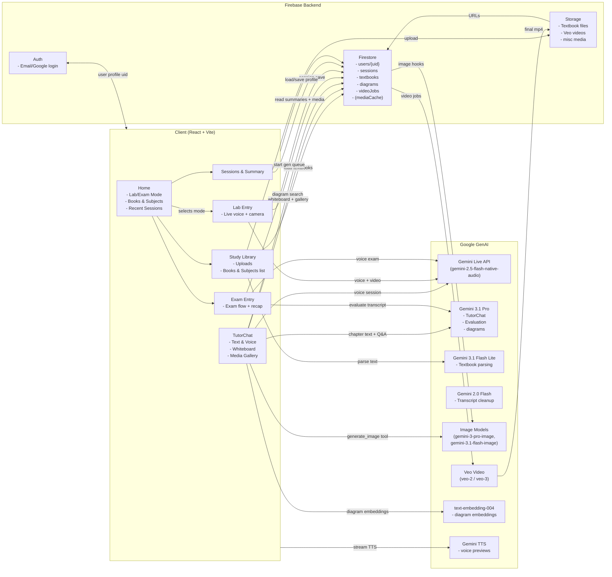

## Mama AI – System Overview

Mama AI is a **voice‑first, multimodal private tutor** built for the **Google Gemini Live Agent Challenge**.  
Instead of being a plain text chatbot, it feels like a native mobile tutor that can **see, hear, speak, read real textbooks, and generate custom visuals and videos** to teach school students.

- **Primary audience**: Students in **Classes 5–12** (NCERT/CBSE and similar curricula), plus parents/teachers who want a safe, grounded tutor.
- **Core idea**: Bring a **human‑like private tutor** into a student’s phone:
  - Talk to the tutor with **voice** (Gemini Live API).
  - Show it homework, lab setups, diagrams via **camera / photos / video**.
  - Learn from **textbook‑grounded explanations** (no hallucinations).
  - See hard topics turned into **custom images and 8‑second animations**.

The app is built with **React + TypeScript + Vite** on the frontend, **Firebase** for backend (Auth, Firestore, Storage), and **Google GenAI** for all AI capabilities (Gemini Live, Gemini 3.1 Pro / Flash, Veo, image, TTS, embeddings).

---

## Core Learning Modes & Concepts

### Lab Mode

- **Goal**: Hands‑on help with science and math experiments / homework using **live voice + camera**.
- **How it works**:
  - Student taps **Lab Mode** on Home.
  - Starts a **Gemini Live** session (`gemini-2.5-flash-native-audio-preview-12-2025`):
    - Streams microphone audio.
    - Optionally streams **rear camera video** (1fps snapshots).
    - Student can upload a single **photo** instead of live video.
  - The tutor:
    - Watches what the student is doing.
    - Explains steps using **age‑appropriate analogies** (based on profile).
    - Can call a `generate_image` tool to **draw custom diagrams**.
  - When the session ends, the full transcript and media are saved as a **Lab session** in Firestore.

### Exam Mode

- **Goal**: Oral exam with **structured evaluation** + **visual recap carousel**.
- **How it works**:
  1. Student taps **Exam Mode**.
  2. A Gemini Live session runs with an **exam‑specific system prompt**:
     - Asks one question at a time.
     - Grades answers gently (what’s correct/missing/wrong).
     - Uses `generate_image` for visuals when needed.
  3. When the exam finishes:
     - The full transcript is fed into **Gemini 3.1 Pro** via `useGeminiReasoning`.
     - It produces **structured JSON**:
       - `correct`, `missing`, `incorrect`
       - `hooks`: memorable “mental anchors” (Skill C style).
  4. A **Generation Queue** process turns those hooks into a **4‑slide visual recap**:
     - **Images** via Gemini image model (“Nano Banana” style).
     - **8‑second animations** via **Veo 2** (or Veo 3 in current code).
     - Local TTS pre‑buffers narration durations.
  5. The **Summary + Carousel** UI lets the student replay the recap as a mini story:
     - Images, then short animations.
     - Narration handled by browser TTS; **no audio** inside the Veo videos themselves.

### Study Mode (Textbook‑Grounded Tutor)

- **Goal**: Eliminate hallucinations by grounding everything in the **student’s actual textbook chapters**.
- **How it works**:
  1. On **Study Library**, student uploads **PDF / EPUB / ZIP** of textbooks.
  2. Client‑side extractors (`pdfjs-dist`, `epubjs`, custom ZIP parser) pull clean text.
  3. `useTextbookParser` sends samples to **Gemini 3.1 Flash Lite**:
     - Detects **subject, grade, language, title**.
     - Detects or confirms **chapters** and builds structured JSON.
  4. Text is saved into Firestore:
     - Top‑level `Textbook` doc with **subject, grade, language, chapters[]**.
     - Heavy `content` lives in `users/{uid}/textbooks/{bookId}/chapters/{index}` docs.
  5. In **TutorChat** (Study → Book → Chapter):
     - Chapter text + optional official answers are injected into a **large system prompt**.
     - Tutor is forced to **only answer using chapter content**.
     - Tutor can:
       - Receive **photos** of the student’s work.
       - Use **whiteboard markers** (`[[WB_START]] ... [[WB_END]]`) for formulas.
       - Call `generate_image` for diagrams.
     - Student can use **text chat** (Gemini 3.1 Pro) or switch into **live voice** (Gemini Live) with **the same grounded prompt**.

---

## Main Pages & What They Do

### Home (`/`)

- **Greeting header**:
  - Uses time of day + first name to show **motivational, personal copy**, e.g.:
    - “Late night legends club, Venu.”
    - “Morning brain switched on, Venu!”
- **Profile bubble**:
  - Top‑right circular avatar with the user’s initial.
  - Tapping opens **Settings**.
- **Mode Cards**:
  - **Lab Mode** card:
    - Teal icon (microscope), soft gradient bubble in top‑right corner.
    - Hover: border + glow expand to feel “alive”.
    - Navigates to `/lab/entry`.
  - **Exam Mode** card:
    - Amber icon (pencil), similar gradient bubble + hover animation.
    - Navigates to `/exam/entry`.
- **Books & Subjects strip**:
  - Horizontal, card‑based list of the student’s textbooks:
    - Icon on the left:
      - Math → calculator, indigo palette.
      - Physics → atom, blue palette.
      - Chemistry → flask, green palette.
      - Biology → DNA, rose palette.
      - etc.
    - Subject name (e.g. **Physics**).
    - Book part (**Part I / Part II**, etc.) in accent color.
    - Meta line: `Class 12 • 6 Chapters` or `5 Units` for Chemistry/Biotech.
  - Each card has:
    - **Subject‑colored border + soft top‑right bubble** that glows on hover.
    - Click → navigates directly to that book’s Study detail page (`/study/{bookId}`).
  - “View All” link jumps to full Study Library.
- **Recent Sessions**:
  - Horizontally scrollable cards summarizing the last few **Lab** and **Exam** sessions:
    - Badge for **Lab** (teal) or **Exam** (amber).
    - Short session summary (title cleaned via Gemini Flash).
    - Date.
  - Clicking any card navigates to the **Sessions** page for details.

### Study Library (`/study`)

- **Purpose**: Manage uploaded textbooks and subjects.
- **Features**:
  - **Upload card**:
    - Large, dashed‑border tile to upload **PDF / EPUB / ZIP**.
    - Shows a playful “Crunching the Knowledge…” loader while `useTextbookParser` runs.
  - **Error banner** for invalid or failed uploads.
  - **Books & Subjects list**:
    - Vertical list of subject cards (same icon/color scheme as Home).
    - Each card:
      - Subject heading (Math, Physics, etc.).
      - Part text extracted from book title.
      - Grade + chapter/unit count.
      - Subject‑colored border + soft **corner bubble glow** that intensifies on hover.
    - Tapping card → `StudyDetail` for that book.
  - **Delete button** (top‑right per card) to remove books from the library.

### Study Detail (`/study/:bookId`)

- Shows:
  - Book subject, grade, language.
  - List of chapters/units with numbers, titles, and small summaries.
- Each chapter card:
  - Displays `subsectionRange` (e.g., “9.1–9.7”).
  - Tapping navigates to **TutorChat** for that chapter.

### Tutor Chat (`/study/:bookId/:chapterIndex`)

- **Overview mode**:
  - Shows a friendly summary and **topic chips** per subsection.
  - Encourages the student to either:
    - Start a **voice session**, or
    - Ask a text question.
- **Chat mode**:
  - Left side: conversation bubbles.
  - Right side (or overlay): optional **WhiteboardView** for formulas.
  - **Text chat**:
    - Uses `GoogleGenAI.chats.create` with **`gemini-3.1-pro-preview`**.
    - System instruction includes:
      - Student profile (name, grade, hobbies, learning style, theme, language).
      - Chapter text and answers text.
      - Strict rules about:
        - Referencing **actual page numbers**.
        - Using **whiteboard markers** for formulas.
        - When and how to generate images.
  - **Voice mode**:
    - Uses `useGeminiLive` with the same system instruction.
    - Allows:
      - Continuous voice conversation.
      - Camera capture of handwritten work.
      - AI‑driven whiteboard episodes.
      - Live `generate_image` calls for extra diagrams.

### Lab Entry (`/lab/entry`)

- Full‑screen, experiment‑oriented layout:
  - Center: live **video feed** or uploaded image, or AI‑generated visual overlay.
  - Bottom bar: **Photo / Video / Mic / End** controls.
- Uses `useGeminiLive` to:
  - Start/stop audio streaming and optional live video frame captures.
  - Save messages via `useSessions.saveSession('lab', ...)` on disconnect.
  - Show mic state:
    - “I’m listening…”
    - “Muted”
    - Warnings if audio is completely silent.

### Exam Entry (`/exam/entry`)

- Orchestrated via a small **exam state machine** (`useExamMachine`):
  - Steps: warmup, questions, evaluation, hooks, carousel, next question, complete.
- Uses `useGeminiLive` to run the oral exam.
- At the **hooks_generation** step:
  - As described earlier, sends transcript to `useGeminiReasoning` (Gemini 3.1 Pro).
- At the **carousel_generation** step:
  - Calls `startGenerationQueue` to create image + video slides.
  - Listens to Firestore updates for:
    - `generationJob.slides` (slides array).
    - `videoJobs` subcollection (Veo job completions).
- Presents the recap in an immersive **CarouselViewer** overlay.

### Sessions (`/sessions`)

- Lists all saved **Lab** and **Exam** sessions for the current user:
  - Modes, dates, summaries.
  - Expandable details or click‑through to **Summary**.

### Summary (`/summary?sessionId=...&mode=...`)

- Shows:
  - High‑level outcome (e.g., star rating, key concept chips).
  - Structured evaluation from `useGeminiReasoning` (for exams).
  - If present, a **“Replay Visual Review”** button to re‑enter the Carousel.

### Settings (`/settings`)

- **Account & profile**:
  - Name, age/grade, gender, learning style, hobbies.
  - Preferred language.
  - UI theme.
- **Voice settings**:
  - Tutor voice selection.
  - Uses `voicePreview` (Gemini TTS) to play **short preview clips**.
- **Other preferences**:
  - Auto‑advance in carousels.
  - Possibly future toggles for whiteboard or diagram density.

### Auth (`/login`, `/signup`, `/onboarding`)

- **Login / Signup**: Firebase Auth (email/password + Google).
- **Onboarding**:
  - Collects profile fields then stores a `UserProfile` in `users/{uid}`.
  - After onboarding, user lands on Home.

---

## AI Models & APIs Used

### Gemini Live (Voice & Vision)

- **Model**: `gemini-2.5-flash-native-audio-preview-12-2025`
- **Usage**:
  - Real‑time voice conversation in **Lab**, **Exam**, and **TutorChat** voice mode.
  - Streams:
    - Audio input (16 kHz PCM) from mic.
    - Optional **image** (uploaded) or **live video** frames (JPEG snapshots).
  - Outputs:
    - Audio (24 kHz PCM) for speech.
    - Transcriptions for both input and output.
  - Tools:
    - `generate_image` function tool (and planned `generate_video`) to call into image / video pipelines.

### Gemini Text / Reasoning

- **`gemini-3.1-pro-preview`**
  - **TutorChat text Q&A** (chapter‑grounded).
  - **Session evaluation** (`useGeminiReasoning`) → JSON with `correct/missing/incorrect/hooks`.
  - **Diagram extraction** (`diagramExtractor`) for vision‑based understanding of textbook diagrams.
- **`gemini-3.1-flash-lite-preview`**
  - **Textbook parsing**:
    - Detects subject, grade, language, title.
    - Segments chapters when not pre‑parsed.
- **`gemini-2.0-flash`**
  - **Session cleanup**: Normalizes voice transcripts and generates short summaries for session history.

### Image Generation (Nano Banana‑style)

- **Models**:
  - Primary: `gemini-3-pro-image-preview`
  - Fallback / fast: `gemini-3.1-flash-image-preview`
- **Usage**:
  - `generateEducationalImage` service creates vertical (9:16) educational images per hook.
  - `useGeminiLive`’s `generate_image` tool uses `gemini-3.1-flash-image-preview` to quickly generate **visual aids** during live sessions.
  - System prompts enforce:
    - **9:16 portrait only** (no landscape/square).
    - Large, readable diagrams.
    - Age‑appropriate complexity.

### Video Generation (Veo)

- **Intended model**: `veo-2.0-generate-001` (some code paths currently use `veo-3-generate`).
- **Usage**:
  - `generateEducationalVideo` builds a **100–150 word Veo‑optimized prompt**:
    - 5‑part structure (shot composition, subject details, action, setting, aesthetics).
    - Explicitly “**8‑second silent educational animation**”.
    - **No audio, no text overlays**, so Live API handles narration.
  - `startVideoGenerationJob`:
    - Calls Veo via `ai.models.generateVideos`.
    - Polls until completion.
    - Downloads video and uploads to Firebase Storage.
    - Saves URL to Firestore under `videoJobs`.
  - Frontend:
    - Uses Firestore listeners to **upgrade placeholder slides** or gallery items when videos are ready.
    - Plays videos in muted, auto‑looping `<video>` elements (Live audio is the only sound).

### TTS & Audio

- **Gemini TTS**: `gemini-2.5-flash-preview-tts`
  - Used via `voicePreview.ts`:
    - Generates short clips for voice selection in Settings.
- **Browser Speech Synthesis**:
  - Used locally (`tts.ts`) for:
    - Narration during visual recap carousels.
    - Estimating durations (`preBufferTTS`) for slide timing.

### Embeddings

- **Model**: `text-embedding-004`
- **Usage**:
  - Used in `diagramExtractor` to embed diagrams.
  - Enables **semantic diagram search** and better diagram‑aware tutoring contexts.

---

## Data & Grounding Strategy

### Firestore Collections

- `users/{uid}`:
  - **UserProfile**: name, age/grade, gender, learning style, hobbies, language, theme, voice preferences.
- `users/{uid}/sessions/{sessionId}`:
  - **SavedSession**:
    - `mode`: `'lab' | 'exam'`.
    - Raw + cleaned `messages[]` with text + image references.
    - `summary` text (from Gemini Flash).
    - Optional `evaluation` (from `useGeminiReasoning`).
    - Optional `generationJob` (slides, status).
- `users/{uid}/textbooks/{bookId}`:
  - **Textbook** metadata:
    - `title`, `subject`, `gradeLevel`, `language`, `numChapters`, `chapters` array.
- `users/{uid}/textbooks/{bookId}/chapters/{index}`:
  - Full chapter `content` and optional `answersContent`.
- `users/{uid}/diagrams`:
  - `ProcessedDiagram` entries: figure labels, captions, page numbers, embeddings, key elements.
- `users/{uid}/sessions/{sessionId}/videoJobs/{jobId}`:
  - Veo job status: `generating | complete | failed` and `videoUrl`.
- (Planned) `users/{uid}/mediaCache/{cacheId}`:
  - Topic‑hashed cache of educational videos/images for re‑use.

### Textbook Grounding Rules

Inside TutorChat’s system instruction:

- **Only answer from provided chapter text**:
  - If a question goes outside scope, the tutor gently says so and redirects.
- **Page number discipline**:
  - Must quote **actual page numbers** found in the text (“Page 257”).
  - Encouraged to pause and ask the student if they’ve found the page.
- **Diagram handling**:
  - Refers to actual figure numbers when available.
  - Can augment diagrams with AI‑generated images or videos, but still grounds explanations on textbook content.

---

## High‑Level Architecture Diagram

---

## End‑to‑End Flow (Example: Exam Mode)

1. **Student starts Exam Mode** on Home.
2. `ExamEntry`:
   - Creates a new `sessionId`.
   - Starts a Gemini Live session with an **exam system instruction** (personalized with profile).
3. Throughout the oral exam:
   - `useGeminiLive` streams mic audio (and optional images).
   - Collects `SessionMessage[]` into local state.
4. When the student ends the exam:
   - `useGeminiLive.disconnect()` triggers `useSessions.saveSession('exam', messages, sessionId)`:
     - Writes raw session to Firestore.
     - Optionally cleans it via `gemini-2.0-flash`.
5. `ExamEntry` detects the `hooks_generation` state:
   - Concatenates transcript.
   - Calls `useGeminiReasoning` (Gemini 3.1 Pro) to get structured evaluation + hooks.
6. On `carousel_generation`:
   - Calls `startGenerationQueue`:
     - For each hook:
       - Uses `generateEducationalImage` (Gemini image) for a vertical slide.
       - Starts `startVideoGenerationJob` (Veo) in background.
       - Computes narration duration using browser TTS.
     - Writes slides + `generationJob` status to Firestore.
7. `CarouselViewer` listens to Firestore:
   - Renders image slides immediately.
   - Upgrades “Generating video…” slides once `videoJobs` docs show `status: complete`.
8. Student watches the **visual recap**:
   - Local TTS narrates.
   - Veo videos play muted in 9:16.
9. Next question or finish, with Live API optionally instructed (via `sendClientMessage`) to move on.

---

## Summary

This project delivers a **full multimodal tutoring system**:

- **Voice + vision** via Gemini Live for natural conversation and real‑world context.
- **Textbook‑grounded Study mode** to kill hallucinations and stay within chapters.
- **Exam mode with deep evaluation and custom visuals** via Gemini Pro + Veo.
- **Per‑subject visuals and carousels** designed for phone screens (9:16, high contrast).
- **Firebase‑backed persistence** of profiles, textbooks, sessions, diagrams, and videos.

By reading this file, another LLM (or human) can reconstruct:

- The purpose and audience of Mama AI.
- All main pages and flows.
- Which **LLM models** and **APIs** are used where.
- How **grounding** and **media generation** are wired into the overall experience.

