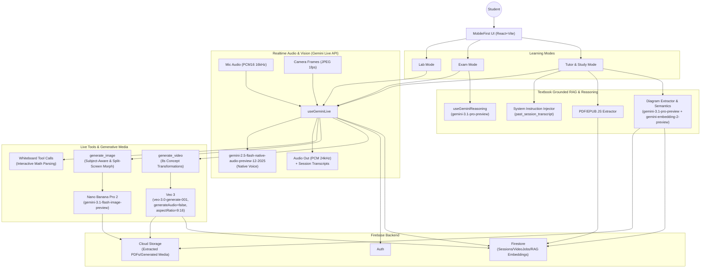

# Mama AI: The Multimodal "Private Tutor"
**Built for the Google Gemini Live Agent Challenge**

[-4C1)](https://ai.google.dev/gemini-api/docs/image-generation)
[-8A2BE2)](https://deepmind.google/technologies/veo/)

[-FFCA28)](https://firebase.google.com/)

**Server URL (Cloud Run / deploy)**: `<SET_ME_AFTER_DEPLOY>`  

## 🌟 Overview
Mama AI is not a generic text chatbot. It is a true **voice-first, multi-modal learning companion** designed specifically for students. It moves far beyond the "text box" paradigm by allowing students to converse naturally with an AI tutor that can hear, speak, see, and dynamically generate visual diagrams or instructional videos (via Google Veo 3) on the fly to explain complex scientific concepts. 

The application is built on a responsive, mobile-first React architecture, making it feel like a native app where the student's camera, microphone, and touchscreen are the primary input modalities. There is no manual text typing fallback—you talk to Mama AI just like you would a human tutor.

## 🗺️ System Diagram (Mermaid)

## ✨ Core Features & Learning Modes

### 🔬 1. Lab Mode (Live Bidi-Streaming)
This is the unstructured, exploratory heart of the "Beyond Text" experience. Utilizing the **Gemini Multimodal Live API (native audio)** via WebSockets, Lab Mode allows for natural, low-latency, bidirectional voice conversations.
- **Barge-in Support:** Students can interrupt Mama AI mid-sentence if they don't understand something, eliminating clunky wake words.
- **Visual Context (The "See" Phase):** Students can toggle their device camera to show Mama AI their physical homework, a science experiment array, or math equations scribbled on paper. The AI processes these video frames in real-time, functioning as her set of "eyes".

### 📝 2. Exam Mode (Active Recall)
Exam Mode forces the student to prove their knowledge. Rather than providing answers, Mama AI actively questions the student.
- **Reasoning Engine:** Powered by `gemini-3.1-pro-preview`, Mama AI generates challenging, subject-specific questions.
- **Audio Answers:** The student speaks their answer into the microphone. Mama AI evaluates the response, gently corrects misconceptions using Socratic methods, and scores the interaction.

### 📚 3. Tutor / Study Mode (Textbook Grounded RAG)
To completely eliminate AI hallucinations, we designed a zero-BS "Textbook Grounded" Retrieval-Augmented Generation (RAG) feature.
- **Immutable Source of Truth:** Students seamlessly upload **ZIPs containing PDFs** of their actual school textbooks. 
- **Client-Side Extraction & Parsing:** The app natively extracts text and table of contents metadata in the browser. 
- **Multimodal Diagram Embeddings:** Diagrams are cropped directly from the PDF pages using computer vision. Both the raw image data AND a semantic description generated by Gemini 3.1 Pro are fused together and vectorized using the new `gemini-embedding-2-preview` model. These multimodal embeddings are stored in Firestore for instant contextual retrieval.
- **Grounded Chat:** When a student enters Study Mode for a specific chapter, the extracted text and diagram metadata formulate a strict system boundary. Mama AI is explicitly prevented from using external internet knowledge; she *must* formulate her voice answers using only the physical textbook material provided to her.

### 🧠 4. Seamless Session Memory & Resumption
Mama AI possesses a literal memory of your past conversations.
- At the end of every voice session, the entire transcript (including locally captured user speech), generated images, and whiteboard sessions are summarized, embedded, and saved to Firestore.
- When a user clicks "Resume Session", she effortlessly routes the user back to the exact textbook chapter. The app injects a `<past_session_transcript>` block directly into Gemini's system instructions, cloning her exact conversational state so she picks up the lesson precisely where you left off.

### 🎨 5. Dynamic Generative Media ("Real-world to Diagram" Morphing)
Mama AI doesn't just talk; she creates bespoke, personalized visual aids on the fly.
- **Nano Banana Pro 2 (`gemini-3.1-flash-image-preview`):** When Mama AI needs to explain a geometric shape or a physics vector, she automatically triggers a tool call to generate a custom 9:16 portrait image. 
- **Veo 3 (`veo-3.0-generate-001`):** For dynamic scientific phenomena (like osmosis or planetary motion), she triggers silent 8-second instructional video animations.
- **Bridging Reality & Theory:** The prompt engineering behind these tools forces the AI to start with a highly relatable, tangible *real-world example* based on the student's profile, and visually morph or place it side-by-side with the abstract *theoretical textbook diagram*. This structural timeline explicitly bridges the cognitive gap between physical reality and science formulas.

### ✍️ 6. The Interactive Smart Whiteboard
When explaining complex, multi-step mathematics, Mama AI opens an interactive digital whiteboard.
- She generates strict LaTeX formulas (`\frac{a}{b}`) and renders them cleanly without horizontal overflow.
- She writes out the problem "Step by Step", and strictly pauses to allow the student to answer or ask questions before advancing to the next step, perfectly mimicking how a human teacher interacts at a chalkboard.

### ⚙️ 7. Personalized Student Profiles
Mama AI dynamically adjusts her teaching style, tone, and analogies based on the student's profile (age, grade, gender). If the student's favorite hobby is "Basketball", Mama AI might utilize Nano Banana Pro 2 to generate an image explaining physics projectile motion using a basketball trajectory overlaid with vectors.

---
*Built with React, Vite, Tailwind CSS, Firebase, and the Google Gemini suite.*
