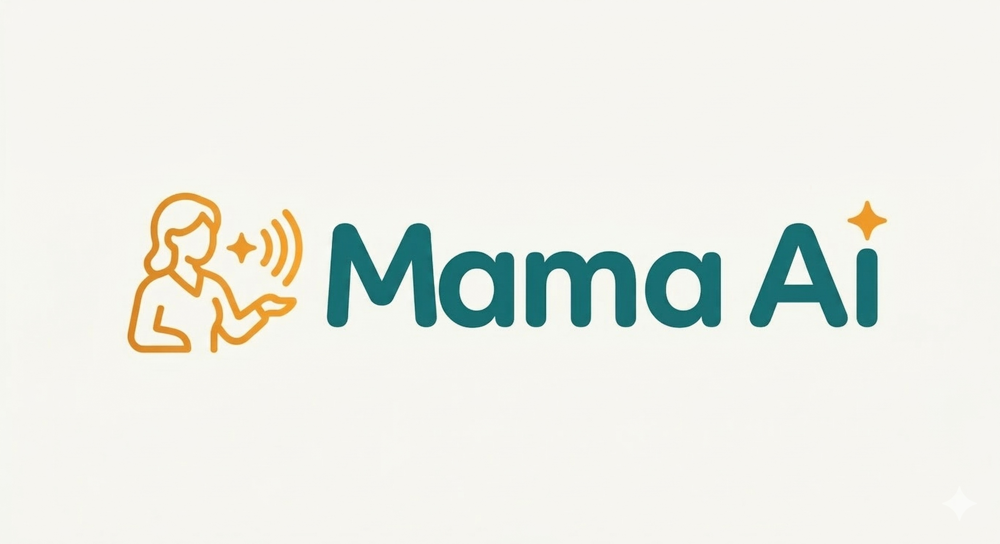
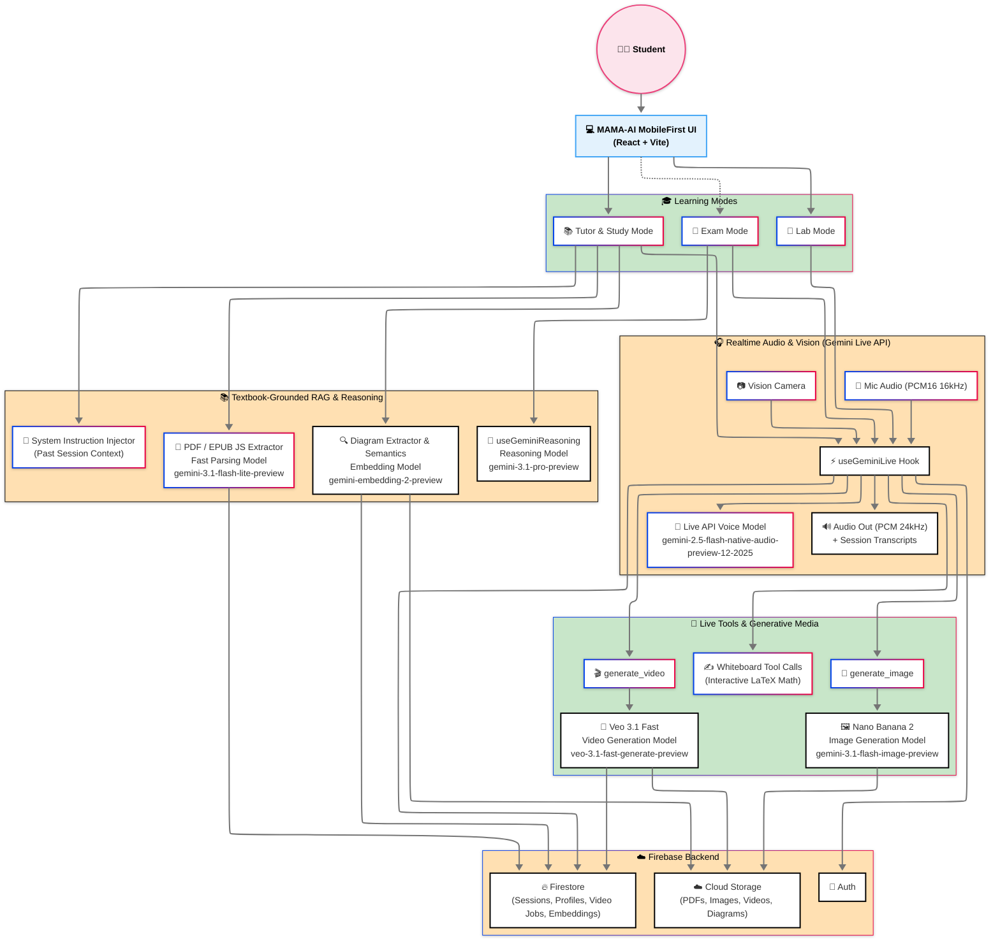

<div align="center">


# Mama AI: The Multimodal "Private Tutor"
**Built for the Google Gemini Live Agent Challenge**

[](./LICENSE)
[](https://ai.google.dev/)
[-4C1)](https://ai.google.dev/gemini-api/docs/image-generation)
[](https://deepmind.google/technologies/veo/)
[](https://ai.google.dev/gemini-api/docs/embeddings)
[](https://vitejs.dev/)
[](https://www.typescriptlang.org/)
[-FFCA28)](https://firebase.google.com/)
[](https://cloud.google.com/run)
[](https://cloud.google.com/storage)

**☁️ Cloud Run URL**: [https://mama-ai-service-972465918951.us-central1.run.app](https://mama-ai-service-972465918951.us-central1.run.app) [](https://mama-ai-service-972465918951.us-central1.run.app)  
</div>

## 🌟 Overview

Mama AI is a **voice-first, multimodal AI tutor** that transforms how students learn STEM subjects. Built for the Google Gemini Live Agent Challenge, it goes far beyond traditional chatbots by offering:

- 🎙️ **Natural Voice Conversations** - Talk to Mama AI like a human tutor using the Gemini Live API
- 👁️ **Vision-Enabled Learning** - Show her your homework, diagrams, or experiments via camera
- 🎨 **Dynamic Visual Generation** - Auto-generates custom diagrams (Nano Banana pro 2) and animations (Veo 3.1) on demand
- 📚 **Textbook-Grounded RAG** - Upload your actual textbooks; Mama AI answers strictly from your materials

### Why Mama AI?

Traditional ed-tech forces students to type questions into a search box. Mama AI eliminates the keyboard entirely—students speak naturally, interrupt freely, and receive personalized visual explanations that bridge the gap between abstract concepts and real-world understanding.

### ⚡ At a Glance

| Category | What We Built |
|----------|---------------|
| **Challenge Category** | Live Agents 🗣️ (Audio/Vision) |
| **Core Tech** | Gemini Live API + Gemini 3.1 Pro + Firebase + Cloud Run |
| **Key Differentiator** | Textbook-grounded RAG with zero hallucination |
| **Visual Generation** | Nano Banana 2 (images) + Veo 3.1 Fast (videos) |
| **Learning Modes** | Lab → Tutor → Exam → Notes |
| **Storage** | Firestore (data) + Cloud Storage (media) |

## 🗺️ System Architecture Diagram

> **📋 Judge Note:** This section provides the **clear visual representation of the system** as required by the submission guidelines. It shows how **Gemini connects to the backend (Firebase), database (Firestore), and frontend (React)**.

### Architecture Overview



### Component Breakdown

| Layer | Components | Technology |
|-------|------------|------------|
| **Frontend** | Voice UI, Whiteboard, Media Gallery, Camera | React + Vite + Tailwind |
| **Live API** | Bidirectional Audio/Vision | `gemini-2.5-flash-native-audio-preview-12-2025` |
| **Image Gen** | Educational diagrams, themed visuals | `gemini-3.1-flash-image-preview` (Nano Banana 2) |
| **Video Gen** | 8-second concept animations | `veo-3.1-fast-generate-preview` |
| **Reasoning** | Study notes, evaluation, parsing | `gemini-3.1-pro-preview` + `gemini-3.1-flash-lite-preview` |
| **RAG** | Textbook embeddings, semantic search | `gemini-embedding-2-preview` |
| **Storage** | Sessions, media, user data | Cloud Firestore + Cloud Storage |

## ✨ Core Features & Learning Modes

### 🔬 Lab Mode — Learn by Doing

> **TL;DR:** Hands-on experiments with real-time camera guidance using **`gemini-2.5-flash-native-audio-preview-12-2025`**. Safety-first approach with natural voice interruptions.

Lab Mode is where science comes alive. We built this specifically for students who learn best through hands-on experimentation. Instead of reading about chemical reactions, you *do* them—with Mama AI watching your every move through the camera.

Here's how it works: Fire up Lab Mode, point your camera at your experiment setup, and start talking. Mama AI uses the **`gemini-2.5-flash-native-audio-preview-12-2025`** Live API to see your surroundings in real-time and hear your voice simultaneously. She'll identify the equipment you've laid out, walk you through each step of the procedure, and most importantly—she prioritizes **safety**. If you're about to mix the wrong chemicals or skip a crucial safety step, she'll interrupt immediately.

The magic? It's completely conversational. Stuck on a step? Just ask. Want to try a different approach? Go for it. The Live API handles interruptions naturally, so you never feel like you're talking to a robot.

---

### 📝 Exam Mode — Test Your Knowledge, Learn from Mistakes

> **TL;DR:** Socratic tutoring with active recall. Uses **`gemini-3.1-pro-preview`** to weave your hobbies (football, cricket, gaming) into explanations. Never gives answers outright—guides you to discover them.

Exam Mode isn't a scary test—it's your personal study buddy that helps you recap and retain what you've learned. The goal here isn't to grade you; it's to strengthen your understanding through active recall.

Mama AI becomes your Socratic tutor. She questions you on the topic, but here's the twist: **she never gives you the answer outright.** Stuck on a physics problem about projectile motion? She won't just blurt out the formula. Instead, she'll ask: "What's your favorite sport? Football? Great—imagine kicking a ball. What direction does it go when you kick it at different angles?"

She weaves your **favorite hobbies and activities** into every explanation. Cricket fan? She'll explain angular momentum using a spinning ball. Gamer? She'll draw parallels to game physics. This personalization happens through **`gemini-3.1-pro-preview`** (with **`gemini-3-pro-preview`** as fallback), which analyzes your responses and crafts follow-up questions that actually make you think.

> **Note:** Exam Mode uses the same visual tools as Tutor Mode, like whiteboard, image generation, and video generation—so you get the full multimodal experience while studying.

---

### 📚 Tutor Mode — Your Textbook, Truly Understood

> **TL;DR:** Zero-hallucination RAG. Upload your PDFs → parsed by **`gemini-3.1-pro-preview`** → embedded with **`gemini-embedding-2-preview`** → stored in Firestore. Answers strictly from your materials + generates custom visuals (Nano Banana 2 + Veo 3.1 Fast).

This is where Mama AI fundamentally differs from every other AI tutor out there.

Generic LLMs hallucinate. They confidently tell you wrong information about your specific curriculum because they don't *know* your textbook. We fixed that.

**Here's our approach:** You upload your actual study materials—PDFs, ePub textbooks, even a ZIP file of your entire semester's notes. Behind the scenes, **`gemini-3.1-pro-preview`** and **`gemini-3.1-flash-lite-preview`** parse every page, extract the table of contents, identify diagrams, and process the full text. Then **`gemini-embedding-2-preview`** kicks in, creating rich multimodal embeddings that combine the textbook text *and* visual diagrams. Everything gets stored in **Firestore**—textbook content, chapter structures, and diagram embeddings.

The result? When you ask a question, Mama AI answers **strictly from your uploaded materials**. No hallucinations. No generic internet answers. Just grounded, curriculum-specific responses.

But we didn't stop there. When concepts get complex, Mama AI automatically generates:

**🎨 Custom Diagrams with Nano Banana 2**  
Using **`gemini-3.1-flash-image-preview`** (falling back to **`gemini-3-pro-image-preview`**), she creates bespoke 9:16 portrait images tailored to your learning context. Explaining electric fields? She'll generate a visualization using analogies from *your* favorite theme—space, anime, realistic, whatever you picked in your profile.

**🎬 Concept Animations with Veo 3.1 Fast**  
For dynamic processes like osmosis or planetary motion, she triggers **`veo-3.1-fast-generate-preview`** to create silent 8-second videos. These aren't generic stock animations—they're generated specifically for the concept you're struggling with, in the visual style you prefer.

**✍️ The Interactive Whiteboard**  
When math gets multi-step, the whiteboard appears. Mama AI doesn't just display formulas—she builds them line by line using proper **LaTeX** rendering. She'll write out Step 1, pause for your confirmation, then proceed to Step 2. It's like having a patient tutor standing next to you at the chalkboard, checking your understanding at every stage.

All generated media (images, videos, whiteboard sessions) gets cached in **Firebase Cloud Storage** so you can revisit it anytime in your study notes.

---

### 📝 My Study Notes — Your Complete Learning History

> **TL;DR:** Every session auto-saved. Uses **`gemini-3.1-pro-preview`** to synthesize conversations, whiteboards, and mistakes into structured study guides with key concepts, formulas & revision tips.

Every conversation, every whiteboard session, every generated image and video—it's all saved automatically. 

Head to "My Study Notes" and you'll find a complete timeline of your learning journey. But here's where it gets smart: Mama AI doesn't just dump raw transcripts on you. She uses **`gemini-3.1-pro-preview`** to synthesize everything—your conversation history, whiteboard steps, key concepts covered, even your mistakes—into a beautifully formatted study guide.

The model ingests the full session context, identifies the core learning objectives, and generates structured notes with key concepts, formula breakdowns, definitions, and personalized revision tips. It's like having a personal note-taker who actually understands what you learned and why it matters.

## 🤖 AI Models & Technologies

Mama AI leverages a sophisticated multi-model architecture to deliver a seamless, voice-first educational experience:

### 🎨 Image Generation
| Model | Purpose |
|-------|---------|
| `gemini-3.1-flash-image-preview` | **Nano Banana 2** - Primary model for generating educational diagrams, whiteboard visuals, and themed illustrations in 9:16 portrait format |
| `gemini-3-pro-image-preview` | **Nano Banana Pro** - Fallback model for image generation when primary model is unavailable |

### 🎬 Video Generation
| Model | Purpose |
|-------|---------|
| `veo-3.1-fast-generate-preview` | **Veo 3.1 Fast** - Generates silent 8-second educational animations (9:16 portrait) for explaining dynamic scientific phenomena |

### 🧠 Reasoning & Text Processing
| Model | Purpose |
|-------|---------|
| `gemini-3.1-pro-preview` | **Primary Reasoning** - Deep pedagogical evaluation, study notes generation, diagram analysis, and complex multi-step problem solving |
| `gemini-3-pro-preview` | **Fallback Reasoning** - Secondary model for reasoning tasks when 3.1 Pro is unavailable |
| `gemini-3.1-flash-lite-preview` | **Fast Processing** - Lightweight text tasks like session heading generation and textbook structure parsing |

### 🔍 Embeddings & RAG
| Model | Purpose |
|-------|---------|
| `gemini-embedding-2-preview` | **Vector Embeddings** - Powers the multimodal RAG system by creating embeddings for textbook text and diagrams, enabling semantic search and contextual retrieval |

### 🗣️ Voice Interaction (Live API)
| Model | Purpose |
|-------|---------|
| `gemini-2.5-flash-native-audio-preview-12-2025` | **Live Voice & Vision** - Enables real-time, bidirectional voice conversations with native audio output and vision capabilities for camera input |

---

## 🏗️ Tech Stack & Architecture

### Frontend
| Technology | Purpose |
|------------|---------|
| **React 18** | Component-based UI library |
| **TypeScript** | Type-safe development |
| **Vite** | Fast build tooling and dev server |
| **Tailwind CSS** | Utility-first styling |
| **Lucide React** | Icon library |
| **KaTeX** | Math formula rendering for whiteboard |

### Backend & Infrastructure
| Technology | Purpose |
|------------|---------|
| **Firebase Auth** | User authentication (email/password) |
| **Cloud Firestore** | Session storage, user profiles, textbook metadata, embeddings |
| **Firebase Cloud Storage** | Generated media (images/videos), PDF textbooks |
| **Google Cloud Run** | Containerized deployment |

### AI/ML Stack
| Technology | Purpose |
|------------|---------|
| **Google GenAI SDK** | Unified interface for all Gemini models |
| **Gemini Live API** | Real-time bidirectional voice + vision |
| **Gemini 3.1 Pro/Flash** | Reasoning, parsing, study notes |
| **Nano Banana 2** | Educational image generation |
| **Veo 3.1 Fast** | Concept animation videos |
| **Gemini Embedding 2** | Multimodal RAG vectorization |

---

## 📁 Project Structure

```
mama-ai/
├── public/                 # Static assets
│   └── assets/            # Images, banners
├── src/
│   ├── components/        # React components
│   │   ├── whiteboard/   # Interactive math whiteboard
│   │   └── Carousel/     # Visual story carousel
│   ├── contexts/         # React contexts (Auth)
│   ├── hooks/            # Custom React hooks
│   │   ├── useGeminiLive.ts       # Live API voice/vision
│   │   ├── useGeminiReasoning.ts  # Evaluation engine
│   │   ├── useTextbookParser.ts   # PDF parsing
│   │   └── useSessions.ts         # Session management
│   ├── pages/            # Route pages
│   │   ├── study/        # TutorChat, StudyLibrary
│   │   ├── exam/         # ExamEntry
│   │   ├── lab/          # LabEntry
│   │   └── SessionDetail.tsx      # Study notes view
│   ├── services/         # Business logic
│   │   ├── imageGen.ts           # Nano Banana integration
│   │   ├── videoGen.ts           # Veo 3.1 integration
│   │   ├── diagramService.ts     # Diagram enhancement
│   │   └── voicePreview.ts       # TTS previews
│   ├── utils/            # Utilities
│   │   ├── diagramExtractor.ts   # PDF diagram extraction
│   │   └── zipExtractor.ts       # ZIP/PDF parsing
│   └── firebase.ts       # Firebase configuration
├── .env.example          # Environment template
├── package.json
└── README.md
```

---

## 🚀 Getting Started

### Prerequisites
- Node.js 18+
- npm or yarn
- Google Cloud account with billing enabled
- Firebase project

### 1. Clone & Install
```bash
git clone https://github.com/yourusername/mama-ai.git
cd mama-ai
npm install
```

### 2. Environment Setup
Copy `.env.example` to `.env.local` and fill in your values:

```env
# Firebase Configuration
VITE_FIREBASE_API_KEY=your_api_key
VITE_FIREBASE_AUTH_DOMAIN=your_project.firebaseapp.com
VITE_FIREBASE_PROJECT_ID=your_project_id
VITE_FIREBASE_STORAGE_BUCKET=your_project.appspot.com
VITE_FIREBASE_MESSAGING_SENDER_ID=your_sender_id
VITE_FIREBASE_APP_ID=your_app_id

# Gemini API
VITE_GEMINI_API_KEY=your_gemini_api_key
```

### 3. Run Locally
```bash
npm run dev
```
App will be available at `http://localhost:5173`

### 4. Build for Production
```bash
npm run build
```

---

## ☁️ Deployment

### Firebase Hosting (Frontend)
```bash
npm install -g firebase-tools
firebase login
firebase init hosting
firebase deploy --only hosting
```

### Cloud Run (Backend/API if needed)
```bash
gcloud builds submit --tag gcr.io/your-project/mama-ai
gcloud run deploy mama-ai-service --image gcr.io/your-project/mama-ai --platform managed
```

---

## 📄 License

MIT License - see [LICENSE](./LICENSE) for details.

---

**Built with ❤️ for the Google Gemini Live Agent Challenge**
