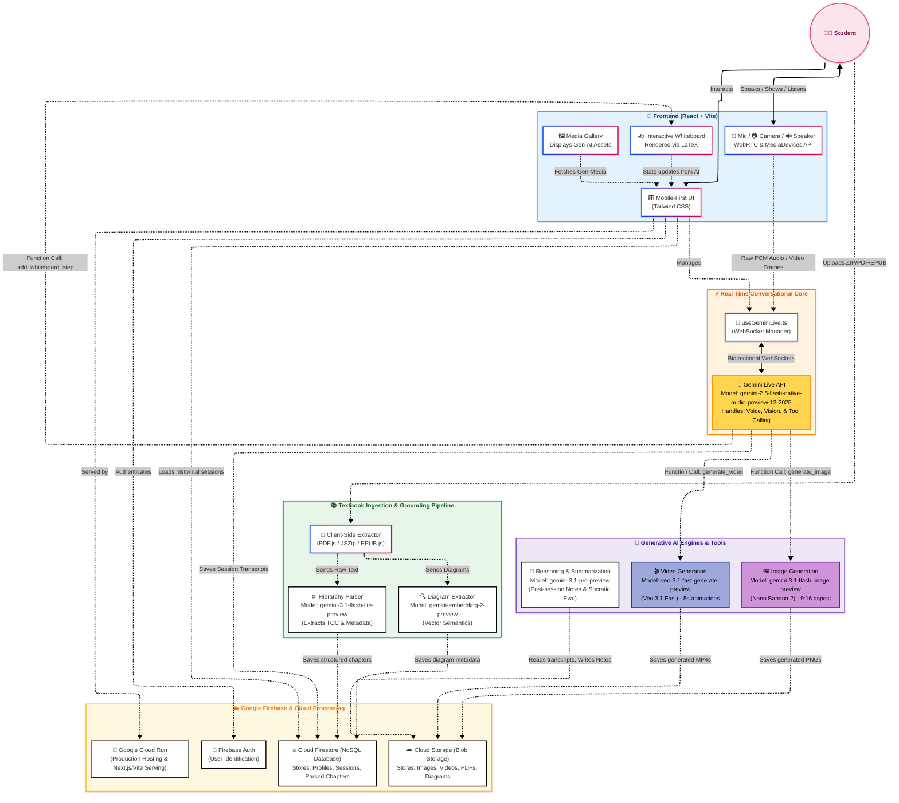

<div align="center">


# Mama AI: The Multimodal "Private Tutor"
**Built for the Google Gemini Live Agent Challenge**

[](./LICENSE)
[](https://ai.google.dev/)
[-4C1)](https://ai.google.dev/gemini-api/docs/image-generation)
[](https://deepmind.google/technologies/veo/)
[](https://ai.google.dev/gemini-api/docs/embeddings)
[](https://vitejs.dev/)
[](https://www.typescriptlang.org/)
[-FFCA28)](https://firebase.google.com/)
[](https://cloud.google.com/run)
[](https://cloud.google.com/storage)

**☁️ Cloud Run URL**: [https://mama-ai-service-972465918951.us-central1.run.app](https://mama-ai-service-972465918951.us-central1.run.app)  
</div>

## 🌟 Overview

Mama AI is a **voice-first, multimodal AI tutor** that transforms how students learn STEM subjects. Built for the Google Gemini Live Agent Challenge, it goes far beyond traditional chatbots by offering:

- 🎙️ **Natural Voice Conversations** - Talk to Mama AI like a human tutor using the Gemini Live API
- 👁️ **Vision-Enabled Learning** - Show her your homework, diagrams, or experiments via camera
- 🎨 **Dynamic Visual Generation** - Auto-generates custom diagrams (Nano Banana pro 2) and animations (Veo 3.1) on demand
- 📚 **Textbook-Grounded RAG** - Upload your actual textbooks; Mama AI answers strictly from your materials

### Why Mama AI?

Traditional ed-tech forces students to type questions into a search box. Mama AI eliminates the keyboard entirely—students speak naturally, interrupt freely, and receive personalized visual explanations that bridge the gap between abstract concepts and real-world understanding.

### ⚡ At a Glance

| Category | What We Built |
|----------|---------------|
| **Challenge Category** | Live Agents 🗣️ (Audio/Vision) |
| **Core Tech** | Gemini Live API + Gemini 3.1 Pro + Firebase + Cloud Run |
| **Key Differentiator** | Textbook-grounded RAG for curriculum-aligned responses |
| **Visual Generation** | Nano Banana 2 (images) + Veo 3.1 Fast (videos) |
| **Learning Modes** | Lab → Tutor → Exam → Notes |
| **Storage** | Firestore (data) + Cloud Storage (media) |

## 🗺️ System Architecture Diagram

> **📋 Judge Note:** This section provides the **clear visual representation of the system** as required by the submission guidelines. It shows how **Gemini connects to the backend (Firebase), database (Firestore), and frontend (React)**.

### Architecture Overview



### Component Breakdown

| Layer | Components | Technology |
|-------|------------|------------|
| **Frontend** | Voice UI, Whiteboard, Media Gallery, Camera | React + Vite + Tailwind |
| **Live API** | Bidirectional Audio/Vision | `gemini-2.5-flash-native-audio-preview-12-2025` |
| **Image Gen** | Educational diagrams, themed visuals | `gemini-3.1-flash-image-preview` (Nano Banana 2) |
| **Video Gen** | 8-second concept animations | `veo-3.1-fast-generate-preview` |
| **Reasoning** | Study notes, evaluation, parsing | `gemini-3.1-pro-preview` + `gemini-3.1-flash-lite-preview` |
| **RAG** | Textbook embeddings, semantic search | `gemini-embedding-2-preview` |
| **Storage** | Sessions, media, user data | Cloud Firestore + Cloud Storage |

## ✨ Core Features & Learning Modes

### 🔬 Lab Mode — Hands-On Experiments

**What it does:** Real-time camera-guided lab experiments with safety monitoring using **`gemini-2.5-flash-native-audio-preview-12-2025`** Live API.

**How to Test:**
1. Navigate to **Lab Mode** from the home screen
2. Allow camera permissions when prompted
3. Point camera at your experiment setup
4. Speak naturally: "What equipment do I need?" or "Is this the correct procedure?"
5. **Expected:** Mama AI identifies equipment, guides steps, and interrupts if safety issues detected

---

### 📝 Exam Mode — Socratic Assessment

**What it does:** Active recall tutoring that uses your hobbies (football, cricket, gaming) to explain concepts via **`gemini-3.1-pro-preview`**. Never gives direct answers—guides you to discover them.

**How to Test:**
1. Select **Exam Mode** → Choose a topic
2. Answer Mama AI's questions verbally
3. When stuck, observe how she uses your favorite hobby to explain
4. **Example:** If you like football, she'll explain projectile motion using ball trajectories
5. **Expected:** Personalized hints that lead you to the answer, not give it directly

> **Note:** Uses same whiteboard, image generation, and video generation as Tutor Mode

---

### 📚 Tutor Mode — Textbook-Grounded Learning

**What it does:** Textbook-grounded RAG system. Upload PDFs → parsed by **`gemini-3.1-pro-preview`** → embedded with **`gemini-embedding-2-preview`** → stored in Firestore. Answers strictly from your uploaded materials, not generic internet sources.

**How to Test:**
1. Go to **Study** → Upload a PDF textbook
2. Wait for parsing (Gemini extracts TOC and diagrams)
3. Select a chapter → Start voice session
4. Ask: "Explain [topic from your textbook]"
5. **Expected:** Answers reference specific pages/sections from YOUR uploaded PDF, not generic internet knowledge

**Visual Tools Auto-Generated:**
| Tool | Trigger | Model Used |
|------|---------|------------|
| **Custom Diagrams** | Complex concepts | `gemini-3.1-flash-image-preview` (Nano Banana 2) |
| **Concept Animations** | Dynamic processes (osmosis, motion) | `veo-3.1-fast-generate-preview` |
| **Interactive Whiteboard** | Multi-step math problems | LaTeX rendering with step-by-step walkthrough |

All media cached in **Firebase Cloud Storage** for later review.

---

### 📝 My Study Notes — Session History

**What it does:** Auto-saves every session. Uses **`gemini-3.1-pro-preview`** to synthesize conversations, whiteboards, and mistakes into structured study guides.

**How to Test:**
1. Complete any voice session (Lab/Exam/Tutor)
2. Navigate to **My Notes** from bottom navigation
3. Select the session you just completed
4. **Expected:** Structured summary with:
   - Key concepts covered
   - Formulas explained
   - Whiteboard steps preserved
   - Generated images/videos accessible
   - Personalized revision tips

## 🤖 AI Models & Technologies

Mama AI leverages a sophisticated multi-model architecture to deliver a seamless, voice-first educational experience:

### 🎨 Image Generation
| Model | Purpose |
|-------|---------|
| `gemini-3.1-flash-image-preview` | **Nano Banana 2** - Primary model for generating educational diagrams, whiteboard visuals, and themed illustrations in 9:16 portrait format |
| `gemini-3-pro-image-preview` | **Nano Banana Pro** - Fallback model for image generation when primary model is unavailable |

### 🎬 Video Generation
| Model | Purpose |
|-------|---------|
| `veo-3.1-fast-generate-preview` | **Veo 3.1 Fast** - Generates silent 8-second educational animations (9:16 portrait) for explaining dynamic scientific phenomena |

### 🧠 Reasoning & Text Processing
| Model | Purpose |
|-------|---------|
| `gemini-3.1-pro-preview` | **Primary Reasoning** - Deep pedagogical evaluation, study notes generation, diagram analysis, and complex multi-step problem solving |
| `gemini-3-pro-preview` | **Fallback Reasoning** - Secondary model for reasoning tasks when 3.1 Pro is unavailable |
| `gemini-3.1-flash-lite-preview` | **Fast Processing** - Lightweight text tasks like session heading generation and textbook structure parsing |

### 🔍 Embeddings & RAG
| Model | Purpose |
|-------|---------|
| `gemini-embedding-2-preview` | **Vector Embeddings** - Powers the multimodal RAG system by creating embeddings for textbook text and diagrams, enabling semantic search and contextual retrieval |

### 🗣️ Voice Interaction (Live API)
| Model | Purpose |
|-------|---------|
| `gemini-2.5-flash-native-audio-preview-12-2025` | **Live Voice & Vision** - Enables real-time, bidirectional voice conversations with native audio output and vision capabilities for camera input |

---

## 🏗️ Tech Stack & Architecture

### Frontend
| Technology | Purpose |
|------------|---------|
| **React 18** | Component-based UI library |
| **TypeScript** | Type-safe development |
| **Vite** | Fast build tooling and dev server |
| **Tailwind CSS** | Utility-first styling |
| **Lucide React** | Icon library |
| **KaTeX** | Math formula rendering for whiteboard |

### Backend & Infrastructure
| Technology | Purpose |
|------------|---------|
| **Firebase Auth** | User authentication (email/password) |
| **Cloud Firestore** | Session storage, user profiles, textbook metadata, embeddings |
| **Firebase Cloud Storage** | Generated media (images/videos), PDF textbooks |
| **Google Cloud Run** | Containerized deployment |

### AI/ML Stack
| Technology | Purpose |
|------------|---------|
| **Google GenAI SDK** | Unified interface for all Gemini models |
| **Gemini Live API** | Real-time bidirectional voice + vision |
| **Gemini 3.1 Pro/Flash** | Reasoning, parsing, study notes |
| **Nano Banana 2** | Educational image generation |
| **Veo 3.1 Fast** | Concept animation videos |
| **Gemini Embedding 2** | Multimodal RAG vectorization |

---

## 📁 Project Structure

```
mama-ai/
├── public/                 # Static assets
│   └── assets/            # Images, banners
├── src/
│   ├── components/        # React components
│   │   ├── whiteboard/   # Interactive math whiteboard
│   │   └── Carousel/     # Visual story carousel
│   ├── contexts/         # React contexts (Auth)
│   ├── hooks/            # Custom React hooks
│   │   ├── useGeminiLive.ts       # Live API voice/vision
│   │   ├── useGeminiReasoning.ts  # Evaluation engine
│   │   ├── useTextbookParser.ts   # PDF parsing
│   │   └── useSessions.ts         # Session management
│   ├── pages/            # Route pages
│   │   ├── study/        # TutorChat, StudyLibrary
│   │   ├── exam/         # ExamEntry
│   │   ├── lab/          # LabEntry
│   │   └── SessionDetail.tsx      # Study notes view
│   ├── services/         # Business logic
│   │   ├── imageGen.ts           # Nano Banana integration
│   │   ├── videoGen.ts           # Veo 3.1 integration
│   │   ├── diagramService.ts     # Diagram enhancement
│   │   └── voicePreview.ts       # TTS previews
│   ├── utils/            # Utilities
│   │   ├── diagramExtractor.ts   # PDF diagram extraction
│   │   └── zipExtractor.ts       # ZIP/PDF parsing
│   └── firebase.ts       # Firebase configuration
├── .env.example          # Environment template
├── package.json
└── README.md
```

---

## 🚀 Getting Started (Reproducible Setup Guide)

> **📋 Judge Note:** This section provides **step-by-step reproducible instructions** for setting up and running Mama AI locally. Follow these steps exactly to recreate the project environment.

### Prerequisites

Before starting, ensure you have:

| Requirement | Version | How to Verify |
|-------------|---------|---------------|
| **Node.js** | 18+ | `node --version` |
| **npm** | 9+ | `npm --version` |
| **Google Account** | Any | Required for Firebase & Gemini API |
| **Git** | Any | `git --version` |

**Required Services:**
- [Google Cloud account](https://cloud.google.com/free) (free tier works)
- [Firebase project](https://console.firebase.google.com/)
- [Gemini API key](https://ai.google.dev/)

---

### Step 1: Clone & Install

```bash
# Clone the repository
git clone https://github.com/yourusername/mama-ai.git

# Navigate to project folder
cd mama-ai

# Install dependencies
npm install
```

**Expected output:** `added XXX packages in XXs`

---

### Step 2: Configure Environment Variables

```bash
# Copy the example environment file
cp .env.example .env.local

# Edit with your credentials
nano .env.local  # or use any text editor
```

**Fill in these required values:**

```env
# ==========================================
# Google Gemini API (Required for AI features)
# Get key at: https://ai.google.dev/
# ==========================================
VITE_GEMINI_API_KEY=your_gemini_api_key_here

# ==========================================
# Firebase Configuration (Required for backend)
# Get these from: https://console.firebase.google.com/project/_/settings/general/web
# ==========================================
VITE_FIREBASE_API_KEY=your_firebase_api_key
VITE_FIREBASE_AUTH_DOMAIN=your-project.firebaseapp.com
VITE_FIREBASE_PROJECT_ID=your-project-id
VITE_FIREBASE_STORAGE_BUCKET=your-project.appspot.com
VITE_FIREBASE_MESSAGING_SENDER_ID=your_sender_id
VITE_FIREBASE_APP_ID=your_app_id
```

---

### Step 3: Run the Development Server

```bash
npm run dev
```

**Expected output:**
```
  VITE v5.x.x  ready in XXX ms

  ➜  Local:   http://localhost:5173/
  ➜  Network: use --host to expose
  ➜  press h + enter to show help
```

**Open your browser:** Navigate to `http://localhost:5173`

---

### Step 4: Test Core Features Locally

Once the app is running, test these key features:

| Feature | How to Test | Expected Result |
|---------|-------------|-----------------|
| **Sign Up** | Create account with email | Account created in Firebase Auth |
| **Upload Textbook** | Go to Study → Upload PDF | PDF appears in library |
| **Voice Mode** | Start Tutor Mode → Click mic | Browser requests mic permission |
| **Image Generation** | Ask "Explain photosynthesis" | Image generates (~5-10s) |
| **Video Generation** | Ask "Show me osmosis" | Video job created, plays when ready |

---

### Step 5: Build for Production

```bash
# Create optimized production build
npm run build

# Output will be in /dist folder
ls -la dist/
```

**Expected:** `dist/` folder contains `index.html` and assets

---

## 🧪 Testing & Verification Checklist

> **📋 For Judges:** Use this checklist to verify the project runs correctly.

### Local Development Tests

```bash
# Run linter (should pass with no errors)
npm run lint

# Type check (should pass)
npx tsc --noEmit

# Build test (should complete without errors)
npm run build
```

### Feature Verification Tests

| Test | Steps | Success Criteria |
|------|-------|------------------|
| **✅ Gemini API Connection** | Start voice mode, speak "Hello" | AI responds with audio |
| **✅ Textbook Upload** | Upload a PDF, wait for parsing | TOC appears, chapters listed |
| **✅ Grounded Answers** | Ask question about uploaded chapter | Answer references textbook content |
| **✅ Image Generation** | Request diagram | 9:16 portrait image appears |
| **✅ Video Generation** | Request animation | 8-second video generates & plays |
| **✅ Whiteboard** | Ask math problem | LaTeX formulas render step-by-step |
| **✅ Session Persistence** | End session, go to My Notes | Session appears with summary |

### API Key Verification

If you encounter errors, verify your API keys:

```bash
# Test Gemini API key
curl "https://generativelanguage.googleapis.com/v1beta/models?key=YOUR_GEMINI_API_KEY"

# Should return list of available models
```

---

## 🔧 Troubleshooting

| Issue | Solution |
|-------|----------|
| `MODULE_NOT_FOUND` | Run `npm install` again |
| `Invalid API Key` | Check `.env.local` for typos |
| `Firebase permission denied` | Enable Firestore and Auth in Firebase Console |
| `Mic not working` | Use HTTPS (deployed) or `localhost` |
| `Build fails` | Ensure Node.js 18+: `node --version` |

---

## ☁️ Deployment

### Firebase Hosting (Frontend)
```bash
npm install -g firebase-tools
firebase login
firebase init hosting
firebase deploy --only hosting
```

### Cloud Run (Backend/API if needed)
```bash
gcloud builds submit --tag gcr.io/your-project/mama-ai
gcloud run deploy mama-ai-service --image gcr.io/your-project/mama-ai --platform managed
```

---

## 📄 License

MIT License - see [LICENSE](./LICENSE) for details.

---

**Built with ❤️ for the Google Gemini Live Agent Challenge**
